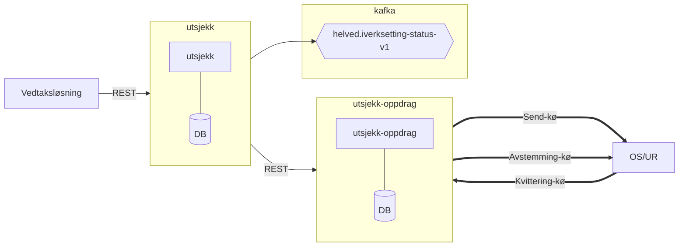

# Om tjenesten

Utsjekk tilbyr tjenester innenfor utbetalingsdomenet for arbeidsytelser. Mer spesifikt kan den sende og korrigere utbetalinger, avstemme utbetalinger og gi oppdatert status på tilstanden til en utbetaling.
Se individuelle sider for dokumentasjon av hver tjeneste.

Hensikten med denne siden er å dokumentere konsepter og funksjonelle aspekter ved Utsjekk sine tjenester som ikke kommer tydelig frem i API-dokumentasjonen. Er du ute etter tekniske detaljer rundt endepunktene, se Swagger-dokumentasjonen
[her](https://utsjekk.intern.dev.nav.no/swagger-ui/index.html) (krever naisdevice). Videre finnes det kontrakter for alle DTO-er som Utsjekk bruker i sitt API [her](https://github.com/navikt/utsjekk-kontrakter).
De aktuelle kontraktene for iverksetting ligger i artifaktet `iverksett`. Vi oppfordrer alle konsumenter til å ta i bruk kontraktene.

## Kontakt

Utsjekk eies av Team Hel Ved. Vi kan kontaktes på Slack i kanalen #team-hel-ved.

## Intern arkitektur

